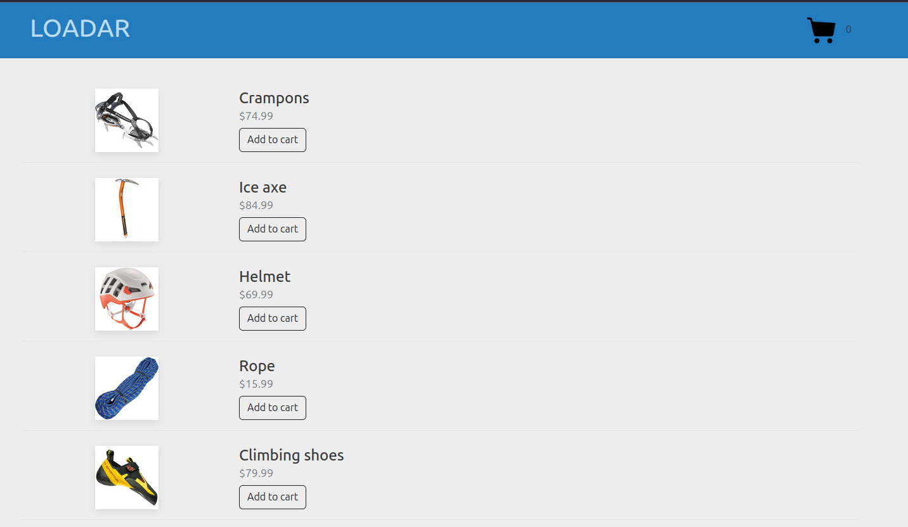

# README

Shopping Cart Rails

Implemented features:
- Changing the quantity of items.
- Deleting items.
- Resetting the cart.
- Recalculating of the amount when the state changes.

Here is the place I struggled I got confused, because "quantity items", which is over the button "Place order" for some reason doesn't update with the rest of parts of page.

The trash icon removes the product from the cart.

"Place order" button clears the session.

I got fetch requests from Turbo.